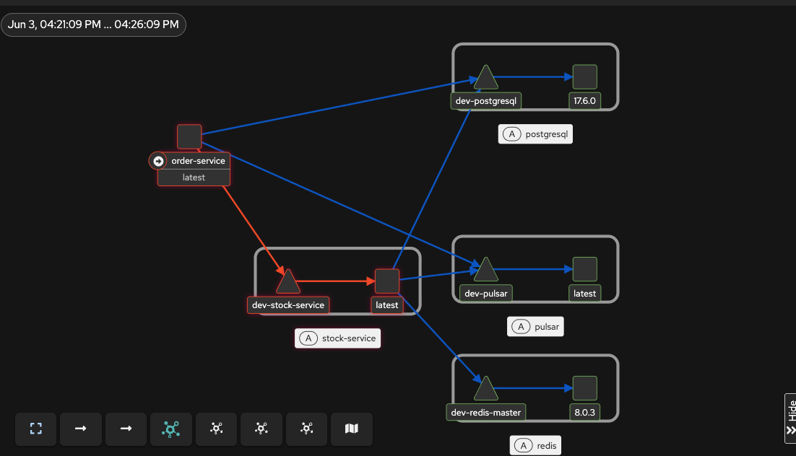

# Flux + Istio Test Setup

Sandbox to test Flux and istio with a simple microservices setup combining Spring Boot services, Istio service mesh, and GitOps via FluxCD.

## Components

- **order-service** – Spring Boot service that accepts orders, calls stock-service to reserve inventory, and publishes `OrderPlaced` events.
- **stock-service** – Spring Boot service that manages inventory, exposes a reserve/replenish API, and consumes `OrderPlaced` events to write an audit trail.
- **PostgreSQL** – primary datastore for both services (separate logical databases).
- **Redis** – idempotency cache for order-service request deduplication.
- **Apache Pulsar** – event broker (standalone mode) carrying `OrderPlaced` events from order-service to stock-service.
- **Istio** – service mesh providing mTLS, traffic routing, and policy enforcement.
- **Kiali** – Istio mesh visualization and observability dashboard.
- **Jaeger** – distributed tracing backend for request timeline analysis.
- **Prometheus + Grafana** – metrics collection and RED (Rate/Error/Duration) dashboard.

## Phase 3: Observability Integration

Phase 3 integrates the full observability stack (Kiali, Jaeger, Prometheus, Grafana) with the Istio mesh. The screenshot below shows Kiali's real-time mesh topology visualization with all service dependencies and mTLS encryption (green padlocks):

**What you see in the topology:**
- **order-service** (red box, left) – the entry point for order requests
- **dev-stock-service** (red box, bottom) – inventory management (called by order-service)
- **dev-postgresql** (gray box, top right) – order and stock databases
- **dev-pulsar** (gray box, middle right) – event broker
- **dev-redis-master** (gray box, bottom right) – cache and idempotency
- **Blue arrows** – mTLS-encrypted traffic flowing between services
- **Green padlocks** – confirmation that mTLS (PeerAuthentication: STRICT) is enforced

**Available tools:**
- Kiali: http://localhost:20001
- Grafana: http://localhost:3000 (admin/admin)
- Jaeger: http://localhost:16686
- Prometheus: http://localhost:9090

See `docs/OBSERVABILITY_QUICK_START.md` for detailed guides on using each tool.

